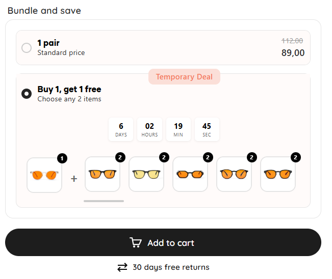

# 🕶️ Bundle & Save UI – Sunglasses Promo

This project showcases a **"Bundle and Save"** user interface component designed for an e-commerce platform.

## 📝 Description

A promotional UI section where users can:

- Select **2 pairs of sunglasses**
- Get **1 free** as part of a **Buy 1, Get 1 Free** offer
- See **discounted pricing** and urgency via a countdown timer
- Easily add the bundle to their cart (_"In winkelwagen"_)

## 📸 Screenshot

## 🌐 Language

The interface is in **Dutch**, including labels such as:

- _"In winkelwagen"_ → Add to cart  
- _"Tijdelijke korting"_ → Temporary discount

## 💡 Use Cases

- E-commerce promotions
- Upsell or bundle UI components
- UX inspiration for product selection interfaces
